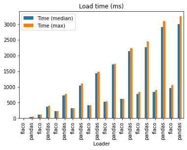

Benchmarks 🐎
---

I've done my best to make benchmarks as fair as possible.
Should you spot something you think is "unfair", please let
me know. 

Benchmarks are hard, if there is a benchmark you'd like to
add or revise, please open a PR! 🔥


Run benchmarks by installing `pip install .[dev]` or
installing the dev requirements you find in `setup.py` if
you've already installed from PypI and rather not install 
from source. Then `make bench`

Test data is either generated, or comes from the 
[pagila](https://github.com/xzilla/pagila/tree/master) git submodule.


TLDR;
Here is a cheap plot of the benchmarks from the incremental size
benchmark; loading tables starting from 10k up to 1.1 million.




```
---------------------------------------------------------------------------------------------------- benchmark: 22 tests -----------------------------------------------------------------------------------------------------
Name (time in ms)                                    Min                   Max                  Mean              StdDev                Median                 IQR            Outliers       OPS            Rounds  Iterations
------------------------------------------------------------------------------------------------------------------------------------------------------------------------------------------------------------------------------
test_basic[flaco]                                98.9535 (10.82)      104.5633 (8.73)       101.6546 (10.28)      1.7591 (2.70)       101.6755 (10.51)      2.0815 (3.52)          4;0    9.8372 (0.10)          9           1
test_basic[pandas]                              239.3087 (26.16)      278.4597 (23.24)      258.5799 (26.15)     17.5600 (26.96)      266.7446 (27.58)     29.9592 (50.66)         3;0    3.8673 (0.04)          5           1
test_incremental_size[rows=10000-flaco]           9.1488 (1.0)         11.9824 (1.0)          9.8866 (1.0)        0.6513 (1.0)          9.6730 (1.0)        0.5914 (1.0)          19;7  101.1470 (1.0)          76           1
test_incremental_size[rows=10000-pandas]         26.7083 (2.92)        55.7707 (4.65)        38.8831 (3.93)      12.1172 (18.60)       30.3433 (3.14)      23.5477 (39.82)        11;0   25.7181 (0.25)         25           1
test_incremental_size[rows=110000-flaco]        108.3831 (11.85)      113.6767 (9.49)       110.4540 (11.17)      2.1414 (3.29)       109.7424 (11.35)      3.5385 (5.98)          2;0    9.0535 (0.09)          8           1
test_incremental_size[rows=110000-pandas]       358.4059 (39.18)      395.0189 (32.97)      374.9845 (37.93)     16.4769 (25.30)      370.5597 (38.31)     30.0910 (50.88)         2;0    2.6668 (0.03)          5           1
test_incremental_size[rows=210000-flaco]        219.9633 (24.04)      227.2699 (18.97)      222.6618 (22.52)      2.8564 (4.39)       221.4291 (22.89)      3.4598 (5.85)          1;0    4.4911 (0.04)          5           1
test_incremental_size[rows=210000-pandas]       684.5278 (74.82)      766.0932 (63.93)      723.4959 (73.18)     30.3815 (46.65)      726.0357 (75.06)     39.7647 (67.24)         2;0    1.3822 (0.01)          5           1
test_incremental_size[rows=310000-flaco]        308.6112 (33.73)      318.3291 (26.57)      314.4970 (31.81)      3.6499 (5.60)       315.5389 (32.62)      4.0602 (6.87)          2;0    3.1797 (0.03)          5           1
test_incremental_size[rows=310000-pandas]       998.4434 (109.13)   1,111.2915 (92.74)    1,042.1497 (105.41)    48.2939 (74.15)    1,033.0153 (106.79)    80.4121 (135.98)        1;0    0.9596 (0.01)          5           1
test_incremental_size[rows=410000-flaco]        413.8400 (45.23)      416.4555 (34.76)      415.2870 (42.01)      1.1777 (1.81)       415.8722 (42.99)      2.0366 (3.44)          1;0    2.4080 (0.02)          5           1
test_incremental_size[rows=410000-pandas]     1,336.6696 (146.10)   1,486.7890 (124.08)   1,418.0573 (143.43)    71.7243 (110.12)   1,435.1231 (148.36)   137.7525 (232.94)        1;0    0.7052 (0.01)          5           1
test_incremental_size[rows=510000-flaco]        516.9954 (56.51)      545.6113 (45.53)      529.0377 (53.51)     14.5453 (22.33)      519.7510 (53.73)     26.3930 (44.63)         2;0    1.8902 (0.02)          5           1
test_incremental_size[rows=510000-pandas]     1,643.2968 (179.62)   1,728.0189 (144.21)   1,700.2846 (171.98)    35.2135 (54.06)    1,715.8074 (177.38)    47.3328 (80.04)         1;0    0.5881 (0.01)          5           1
test_incremental_size[rows=610000-flaco]        605.3312 (66.17)      620.5660 (51.79)      612.6399 (61.97)      6.6027 (10.14)      611.3262 (63.20)     11.7582 (19.88)         2;0    1.6323 (0.02)          5           1
test_incremental_size[rows=610000-pandas]     1,925.9996 (210.52)   2,241.0225 (187.03)   2,113.1431 (213.74)   131.1971 (201.43)   2,140.7972 (221.32)   213.7997 (361.53)        1;0    0.4732 (0.00)          5           1
test_incremental_size[rows=710000-flaco]        747.4373 (81.70)      832.3955 (69.47)      778.8832 (78.78)     34.6604 (53.22)      770.7540 (79.68)     51.0465 (86.32)         1;0    1.2839 (0.01)          5           1
test_incremental_size[rows=710000-pandas]     2,177.4769 (238.01)   2,456.8933 (205.04)   2,294.9800 (232.13)   121.6082 (186.71)   2,262.6261 (233.91)   212.2037 (358.84)        1;0    0.4357 (0.00)          5           1
test_incremental_size[rows=810000-flaco]        832.0848 (90.95)      905.0083 (75.53)      851.8406 (86.16)     30.1966 (46.36)      838.9192 (86.73)     25.9784 (43.93)         1;1    1.1739 (0.01)          5           1
test_incremental_size[rows=810000-pandas]     2,762.8795 (301.99)   3,098.5853 (258.59)   2,896.7442 (293.00)   135.2948 (207.72)   2,902.2630 (300.04)   199.2797 (336.98)        1;0    0.3452 (0.00)          5           1
test_incremental_size[rows=910000-flaco]        943.6544 (103.15)   1,061.8248 (88.62)      996.3521 (100.78)    53.1403 (81.59)      967.3425 (100.00)    90.0884 (152.34)        1;0    1.0037 (0.01)          5           1
test_incremental_size[rows=910000-pandas]     2,811.6877 (307.33)   3,250.6416 (271.28)   3,037.9943 (307.28)   169.9755 (260.97)   3,003.7998 (310.53)   247.2927 (418.17)        2;0    0.3292 (0.00)          5           1
------------------------------------------------------------------------------------------------------------------------------------------------------------------------------------------------------------------------------
```
